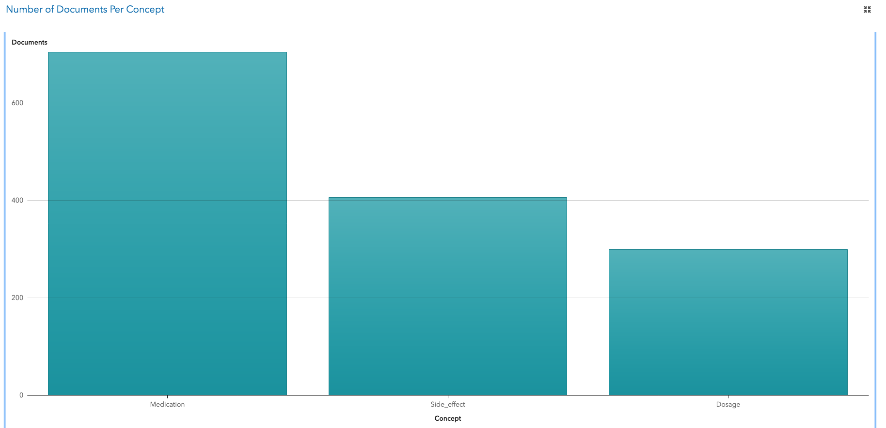

# Assignment 3 - Data Analysis

* Assessment weight: 20% of the total unit assessment.

In this assignment you will provide data analysis within the context of a business application. The specifications below indicate what you need to produce, but not how to produce it. You are free to use any software package, or any programming environment if you wish, to produce the charts of the submission report.

## Topic: Analysis of patient comments about drug effects.

We will use a data set of patient comments about drug effects available as SAS Viya for Learners. This data set can be found with the name DRUG_REPORTS in the SAS drive.

The data set has been generated from individual text files that were extracted from an online forum. The forum is associated with prescription medications that were used for the treatment of depression. The names of the medications that are referenced in the documents were altered. These documents discuss weight gain and sleeplessness.

**It will be very useful if, before attempting this assignment, you complete the introductory demo and the first case study in the SAS Visual Text Analytics course for SAS Viya.**

* [Course notes](../reading/LWSVTA34_001.pdf)
* [Offline data (save this file and uncompress it)](DrugDest.zip)

Your task is to produce a report including various charts that address the following questions. Some of the questions will tell you exactly what kind of chart you need to produce, but other questions will only express a need for some information and you need to decide what chart or set of charts would help find the information.

In your report, answer each task using these headings or equivalent:

* **Chart** (or **Charts** when appropriate), where you insert the charts. Make sure that the charts have the appropriate titles and legends. 
* **How the chart(s) was/were produced**, where you explain what software you used, and if appropriate how you used the software to obtain the data and to produce the charts. There should be enough information so that the assessor can reproduce the charts. *Note that in some tasks you may need to use a tool to obtain the data, and a different tool to produce the charts.*
* **Discussion**, where you explain how the chart(s) can be used to answer the question asked in the task.

## Task 1 (2 marks) - How many documents mention a medication, or a dosage, or a side effect?

Plot a bar chart that shows the number of documents that contain a medication, the number of documents that contain a dosage, and the number of documents that contain a side effect. Your plot should look like this one.

To help you with this task, below is a list of definitions that can be used in SAS Viya for Learners:

* [DosageConcept.txt](DosageConcept.txt). Text sample text: He obtained Tenactol 10mg and Revinor 25 mg.
* [MedicationConcept.txt](MedicationConcept.txt). Test sample text: He obtained Tenactol 10mg and Revinor 25 mg.
* [SideEffectsConcept.txt](SideEffectsConcept.txt). Test sample text: Side effects for Zindol are tiredness, weakness, weight gain, and inappropriate giggling.

## Task 2 (3 marks) - How many documents mention each medication?

Display the counts of number of documents that mention each of the following medications:

1. Abidal
2. Cenerol
3. Ecstapin
4. Fortifex
5. Prexifan 

Choose the appropriate chart or charts to display this information so that it is easy to compare the numbers of documents for each medication.

## Task 3 (5 marks) - Which medications are associated with sleep issues?

Identify the medications that are associated with sleep issues. Your chart or charts should clearly indicate which medications have stronger associations with sleep issues, and they should quantify the degree of association.

## Task 4 (5 marks) - What are the most common concerns expressed?

To complete this task, you need to determine the main concerns expressed in the posts. For this task you are free to use any tools or combination of tools. Make sure that you explain what tools you are using and how, and how to read the charts that you produce.

## Task 5 (5 marks) - Provide useful additional information.

This final task is open. Provide additional charts that would help the analyst find additional useful information about drug effects on patients. For this task, in addition to explaining how the charts were produced and how to read them, it is important that you explain how the information is useful.

## Submission

* Submit your report as a PDF file. The file must include your name and student number.
* Penalty for late submission: 2 marks per day late.
